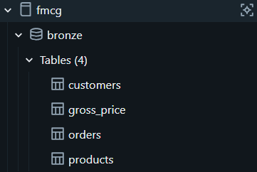
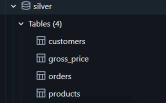
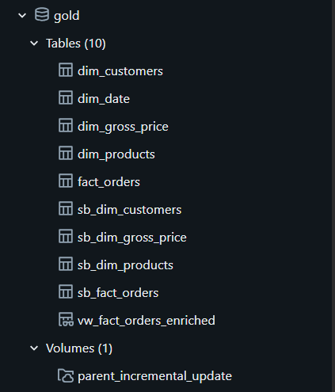
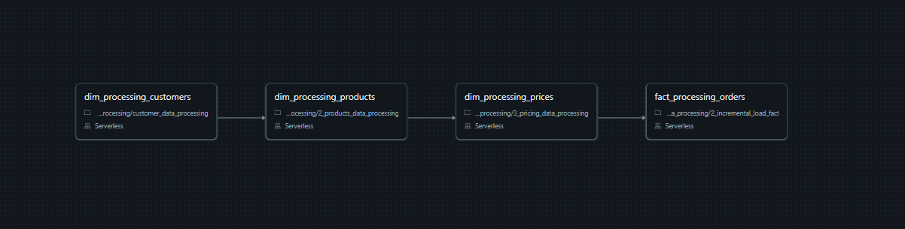
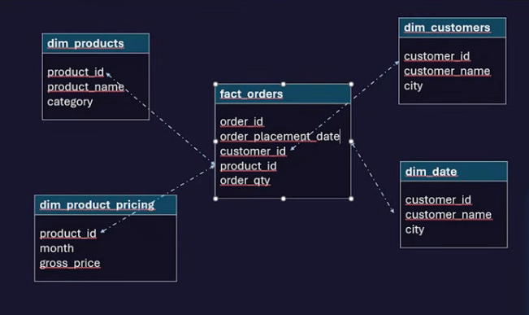

# Atlikon SportsBar FMCG Lakehouse ETL Pipeline

This project presents an end-to-end data engineering pipeline for a realistic FMCG acquisition scenario. The parent company, **Atlikon**, is a B2B sports equipment seller that sells products such as hockey gloves, soccer cleats, training gear, and related sports equipment. Atlikon recently acquired a smaller child company, **SportsBar Co.**, a B2B seller of hydration drinks, protein drinks, protein cookies, and sports nutrition products.

After the acquisition, the biggest challenge was that both companies captured and stored business data differently. Atlikon already had structured analytics-ready data, while SportsBar Co. relied heavily on Excel-based data entry and inconsistent file formats. This created mismatches across customers, products, prices, and orders, which caused broken reporting numbers and unreliable dashboards.

The goal of this project was to standardize and consolidate both companies' data into a single Databricks Lakehouse using a Medallion Architecture: **Bronze**, **Silver**, and **Gold**.

---

## Table of Contents

- [Project Overview](#project-overview)
- [Business Problem](#business-problem)
- [Solution](#solution)
- [Architecture](#architecture)
- [Tech Stack](#tech-stack)
- [Data Sources](#data-sources)
- [Lakehouse Design](#lakehouse-design)
- [Pipeline Workflow](#pipeline-workflow)
- [Data Processing Layers](#data-processing-layers)
- [Gold Layer Data Model](#gold-layer-data-model)
- [Dashboard and Serving Layer](#dashboard-and-serving-layer)
- [Automation and Monitoring](#automation-and-monitoring)
- [Business Questions Answered](#business-questions-answered)
- [Project Impact](#project-impact)
- [Data Quality Rules](#data-quality-rules)
- [Future Improvements](#future-improvements)
- [End Note](#end-note)

---

## Project Overview

This project simulates a real-world FMCG data engineering use case where a larger retail company acquires a smaller company and needs to consolidate data across both organizations.

The pipeline handles:

- Historical full-load data up to **November 30, 2025**
- Incremental future order data after the acquisition
- Customer standardization
- Product standardization
- Price standardization
- Order processing
- Deduplication
- Null handling
- Date standardization
- Monthly aggregation
- Parent-child company data consolidation
- Final gold-layer tables for analytics, dashboards, and AI-assisted exploration

The final output is a curated Lakehouse model that supports dashboards, Genie, and downstream analytics.

---

## Business Problem

Atlikon acquired SportsBar Co., but both companies had different ways of recording core business entities:

- Customer records used different formats.
- Product names and product IDs did not follow the same structure.
- Gross prices were captured inconsistently.
- Orders were stored in different file formats and update patterns.
- SportsBar Co. data was manually entered through Excel, leading to duplicate records, inconsistent values, and broken joins.
- Existing dashboards produced incorrect numbers because parent and child company datasets could not be reliably merged.

The main business issue was that leadership could not get a trusted combined view of both companies after the acquisition.

This created problems such as:

- Incorrect sales totals
- Broken revenue dashboards
- Duplicate customer and product records
- Inconsistent order-level reporting
- Difficulty comparing parent and child company performance
- No automated process for future incoming child-company data

The business needed a pipeline that could standardize both historical and future data into one reliable analytical model.

---

## Solution

The solution is a Databricks Lakehouse pipeline that consolidates Atlikon and SportsBar Co. data using a Bronze-Silver-Gold architecture.

The pipeline performs the following:

1. Loads raw CSV data from Amazon S3.
2. Stores raw records in the Bronze layer.
3. Cleans and standardizes fields in the Silver layer.
4. Builds final dimension and fact tables in the Gold layer.
5. Merges SportsBar child-company data with Atlikon parent-company data.
6. Creates a final enriched fact view for dashboards and Genie.
7. Supports both historical full-load processing and future incremental order updates.

The project is designed to reflect a realistic post-acquisition data consolidation problem in the FMCG domain.

---

## Architecture

The architecture uses Amazon S3 as the raw data source and Databricks as the central processing and lakehouse platform.


### High-Level Flow

```text
Amazon S3 Raw Files
        ↓
Databricks Workflows / Lakeflow Jobs
        ↓
Bronze Layer
        ↓
Silver Layer
        ↓
Gold Layer
        ↓
Dashboards / Genie / Serving Layer
```

The architecture separates raw ingestion, cleaning, business transformation, and serving logic into clear layers.

---

## Tech Stack

The project uses the following tools and technologies:

| Tool / Service | Purpose |
|---|---|
| Python | Data processing and transformation logic |
| SQL | Table creation, querying, joins, and business logic |
| PySpark / Spark | Distributed processing inside Databricks |
| Amazon S3 | Raw file storage |
| Databricks | Lakehouse platform, notebooks, workflows, and Unity Catalog |
| Unity Catalog | Catalog, schema, table, and volume governance |
| Delta Lake | Reliable lakehouse table storage |
| Medallion Architecture | Bronze, Silver, Gold layer design |
| BI Dashboard | Business reporting and visualization |
| Databricks Genie | Natural-language analytics layer |

---

## Data Sources

The project uses four main raw datasets:

| Dataset | Description |
|---|---|
| `customers.csv` | Customer master data |
| `products.csv` | Product master data |
| `gross_price.csv` | Product pricing data |
| `orders/` | Historical and incremental order files |

The raw source data is stored in Amazon S3 and then loaded into Databricks.

The historical full-load data contains records up to **June 30, 2025**. Incremental data represents future transactions and simulates new incoming order data after the acquisition.

---

## Lakehouse Design

The Databricks Unity Catalog is organized under the `fmcg` catalog with three schemas:

```text
fmcg
├── bronze
├── silver
└── gold
```

### Bronze Schema

The Bronze layer stores raw ingested data with minimal transformation.



Bronze tables:

```text
fmcg.bronze.customers
fmcg.bronze.products
fmcg.bronze.gross_price
fmcg.bronze.orders
```

### Silver Schema

The Silver layer stores cleaned and standardized data.



Silver tables:

```text
fmcg.silver.customers
fmcg.silver.products
fmcg.silver.gross_price
fmcg.silver.orders
```

### Gold Schema

The Gold layer stores business-ready dimension and fact tables.



Gold tables include both parent-company and SportsBar child-company tables:

```text
fmcg.gold.dim_customers
fmcg.gold.dim_products
fmcg.gold.dim_gross_price
fmcg.gold.dim_date
fmcg.gold.fact_orders

fmcg.gold.sb_dim_customers
fmcg.gold.sb_dim_products
fmcg.gold.sb_dim_gross_price
fmcg.gold.sb_fact_orders

fmcg.gold.vw_fact_orders_enriched
```

Tables with the `sb_` prefix represent SportsBar child-company data. Tables without the prefix represent Atlikon parent-company data.

---

## Pipeline Workflow

The Databricks workflow contains multiple processing jobs that run in sequence. The workflow is also configured with a scheduled trigger to run automatically every night at **11:00 PM**, with failure notifications enabled for monitoring.



Pipeline jobs include:

```text
dim_processing_customers
        ↓
dim_processing_products
        ↓
dim_processing_prices
        ↓
fact_processing_orders
```

### Workflow Description

1. **`dim_processing_customers`**
   - Processes customer data.
   - Standardizes customer records.
   - Removes duplicate and invalid customer entries.
   - Creates a clean customer dimension.

2. **`dim_processing_products`**
   - Processes product master data.
   - Standardizes product attributes.
   - Preserves product IDs and product names for consistency.
   - Creates a clean product dimension.

3. **`dim_processing_prices`**
   - Processes gross price data.
   - Standardizes pricing fields.
   - Ensures pricing can join correctly with product data.
   - Creates a clean product pricing dimension.

4. **`fact_processing_orders`**
   - Processes historical and incremental order data.
   - Standardizes order dates and quantities.
   - Joins orders with customer, product, and pricing dimensions.
   - Produces final fact tables and enriched reporting views.

---

## Data Processing Layers

### Bronze Layer: Raw Data

The Bronze layer stores raw source files as tables without heavy transformation. This layer acts as a historical landing zone and preserves source-level data for traceability.

Key tasks:

- Load CSV files from Amazon S3.
- Preserve original source values.
- Store raw customers, products, prices, and orders.
- Maintain separation between source ingestion and business logic.

### Silver Layer: Cleaned Data

The Silver layer applies data quality and standardization logic.

Key transformations:

- Standardized date fields.
- Converted daily-level records into monthly aggregation where required.
- Removed duplicate records.
- Removed unnecessary null values.
- Standardized customer, product, price, and order columns.
- Cleaned inconsistent Excel-fed child-company data.
- Prepared tables for reliable joins.

This layer ensures that the same business entities can be compared and merged across Atlikon and SportsBar Co.

### Gold Layer: Business-Ready Data

The Gold layer contains analytics-ready tables for reporting and serving.

Key outputs:

- Customer dimension
- Product dimension
- Gross price dimension
- Date dimension
- Orders fact table
- SportsBar-specific dimension and fact tables
- Enriched fact order view

The enriched fact view combines order, customer, product, price, and date information into a dashboard-ready dataset.

---

## Gold Layer Data Model

The Gold layer follows a star-schema-style structure.



Core model:

```text
dim_customers
dim_products
dim_product_pricing
dim_date
        ↓
fact_orders
```

The `fact_orders` table connects to customer, product, pricing, and date dimensions. This structure enables clean dashboard filtering and business analysis.

### Example Gold Tables

| Table | Purpose |
|---|---|
| `dim_customers` | Standardized customer master |
| `dim_products` | Standardized product master |
| `dim_gross_price` | Product pricing dimension |
| `dim_date` | Date dimension for time-based analysis |
| `fact_orders` | Final processed order fact table |
| `vw_fact_orders_enriched` | Final enriched view for dashboarding and Genie |

---

## Dashboard and Serving Layer

The Serving Layer supports BI dashboards and Databricks Genie.

### Dashboard Overview

.png)
.png)
.png)
.png)

The dashboard can be used to analyze:

- Monthly sales trends
- Product-level revenue
- Customer-level order activity
- Parent-company vs child-company performance
- Product category performance
- Standardized order quantities
- Pricing and revenue consistency
- Impact of the acquisition on consolidated reporting

Databricks Genie can be used on top of the final gold tables to allow business users to ask natural-language questions about sales, customers, products, and order trends.

---

## Automation and Monitoring

To make the pipeline more production-ready, an automated schedule trigger was configured in Databricks.

The workflow is scheduled to run every night at:

```text
11:00 PM
```

This allows new incremental order files to be processed automatically without requiring manual execution.

A failure notification was also configured so that if the pipeline fails, an alert is sent immediately. This helps reduce the risk of silent pipeline failures and makes the workflow easier to monitor and maintain.

This automation improves the reliability of the project by supporting:

- Scheduled nightly processing of future incremental order data.
- Reduced manual intervention.
- Faster awareness of failed pipeline runs.
- Better operational monitoring for production-style ETL workflows.
- More reliable downstream dashboards and Genie outputs.


## Business Questions Answered

This project helps answer business questions such as:

- What is the consolidated order volume after merging Atlikon and SportsBar Co. data?
- Which products and categories generate the highest order quantities?
- Which customers contribute the most to order volume?
- How do parent-company and child-company sales patterns compare?
- Are there inconsistencies between historical full-load data and incremental order data?
- How have monthly orders changed after standardizing the child-company data?
- Which product pricing records are missing, duplicated, or inconsistent?
- Can leadership trust the merged dashboards after the acquisition?
- Are SportsBar Co. products joining correctly with the final fact table?
- Are future incremental order files being standardized automatically?

---

## Project Impact

This project solves a common real-world data engineering problem: integrating a newly acquired company's inconsistent operational data into a parent company's analytics ecosystem.

The impact includes:

- Creates a single source of truth for parent and child company data.
- Fixes broken dashboards caused by inconsistent Excel-fed source files.
- Enables reliable reporting across customers, products, prices, and orders.
- Supports future incremental data ingestion instead of only historical one-time loads.
- Improves trust in business KPIs after acquisition.
- Reduces manual data cleaning and reconciliation work.
- Provides a scalable foundation for future dashboarding, forecasting, and business analysis.

For Atlikon, this means leadership can evaluate the acquisition using standardized data instead of disconnected files and unreliable dashboards.

---

## Data Quality Rules

The pipeline applies several data quality and standardization rules:

- Preserve customer IDs and product IDs.
- Preserve product names while standardizing table structure.
- Standardize city and market fields where required.
- Remove duplicate customer, product, price, and order records.
- Remove unnecessary null values.
- Standardize date columns.
- Convert daily data into monthly aggregation where required.
- Ensure order records can join with customer, product, and pricing dimensions.
- Separate parent-company and child-company data using clear `sb_` naming conventions.
- Build final enriched fact views for reporting.

---

## Future Improvements

Possible future enhancements include:

- Add automated data quality checks with expectations.
- Add error logging for failed incremental files.
- Add pipeline alerting for missing customer, product, or pricing joins.
- Add incremental merge logic using Delta Lake `MERGE`.
- Add slowly changing dimension handling for customer and product changes.
- Add forecasting for future monthly demand.
- Add Genie-certified business metrics for governed natural-language analytics.
- Add CI/CD deployment for Databricks workflows and notebooks.
- Add more detailed parent vs child company profitability analysis.

---

## End Note

This project demonstrates how a modern data lakehouse can solve a realistic post-acquisition data consolidation problem in the FMCG domain. By using Databricks, Amazon S3, Spark, SQL, Medallion Architecture, dashboards, and Genie, the project turns inconsistent raw files into standardized, analytics-ready business tables.

The final solution provides Atlikon with a reliable foundation for consolidated reporting, future incremental processing, and business decision-making after acquiring SportsBar Co.
